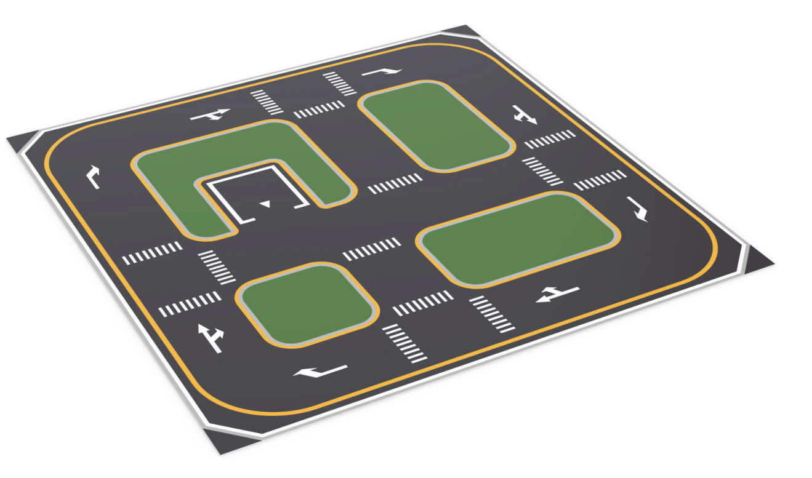
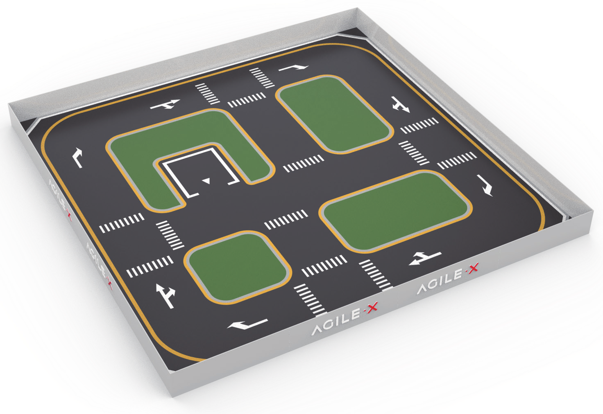
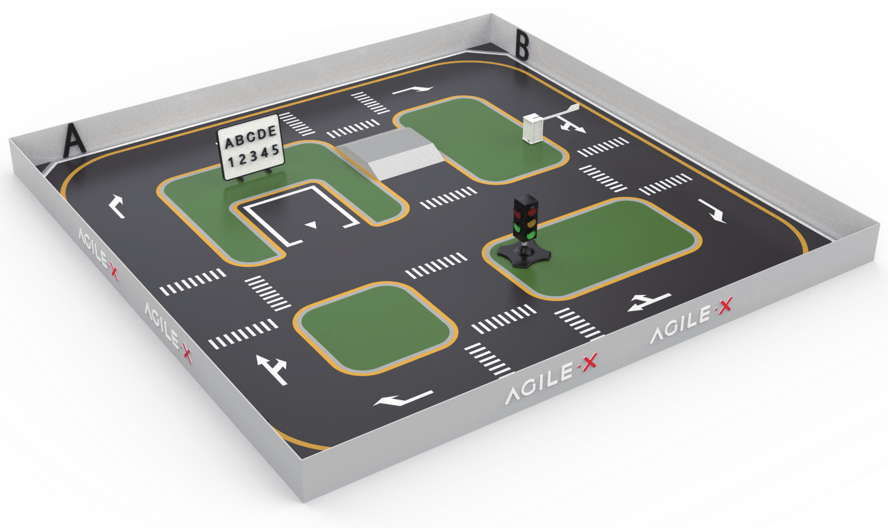
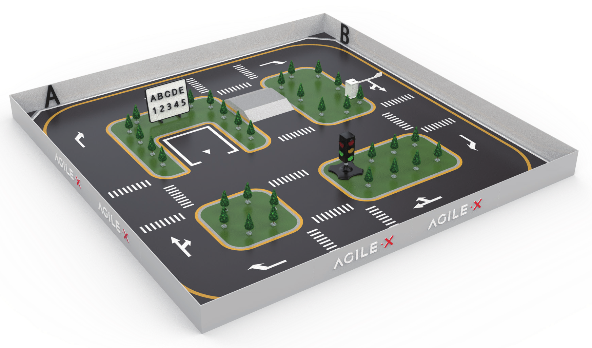

======================
Simulation Table Setup
======================

Build the Bottom Plate
======================

Arrange the plates according to the diagrams below.

.. list-table::
    :align: center

    * - .. image:: _images/sim_table_bottom.png
            :align: center
            :width: 50%
      - .. image:: _images/sim_table_bottom_numbered.png
            :align: center
            :width: 50%

The table should look like the image below when completed.

Build the Border
================

Enclose the border around the Table and fix the border with the L and U-shaped buckles. The two
borders in the middle of each side are patterned, the other two are not.

.. list-table::
    :align: center
    :widths: 70 30

    * - .. image:: _images/sim_table_perimeter.png
            :align: center
      - .. image:: _images/sim_table_perimeter_callout.png
            :align: center

The border should look like the image below when completed.

Install Table Components
========================

1.  Affix the ABCD characters at the end of each of the roads for the LIMO to identify its location
    during navigation.
2.  Place the Whiteboard behind the Table's parking space.
3.  Place the traffic light.
4.  Affix the AR tag to the end of the Lifting Lever's gate such that the tag will be in the middle
    of the road when it is placed.
5.  Place the Lifting Lever.

The components should look something like the image below when completed.

Place Model Trees
=================

The trees should look something like the image below when completed.

Affix Table to it's Working Surface
===================================

If the friction between the Table and the surface it's on is small such that the motion of the LIMO
causes the table to move, the tape in the accessories can be used to better hold the table in
place.
