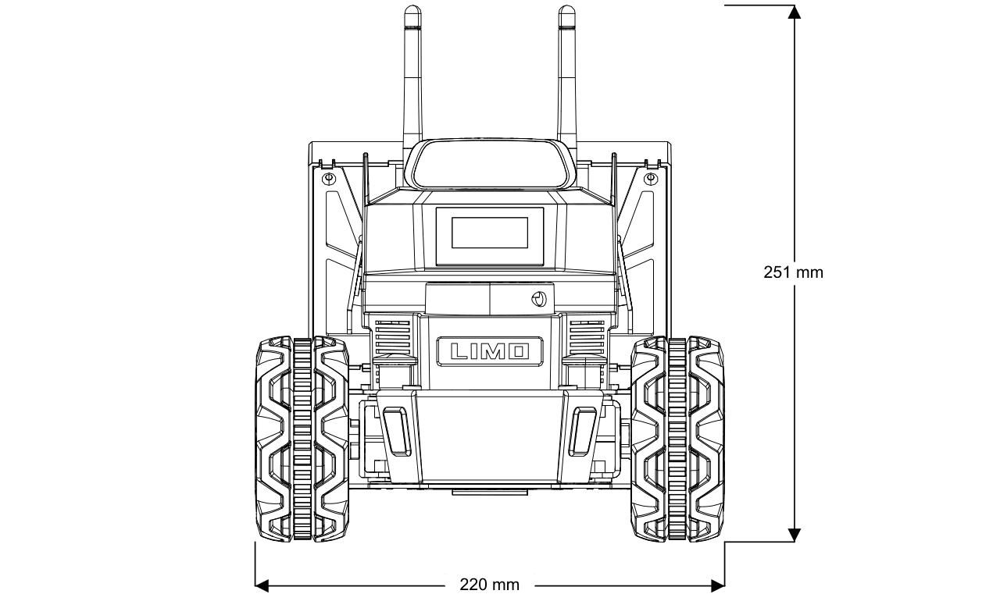
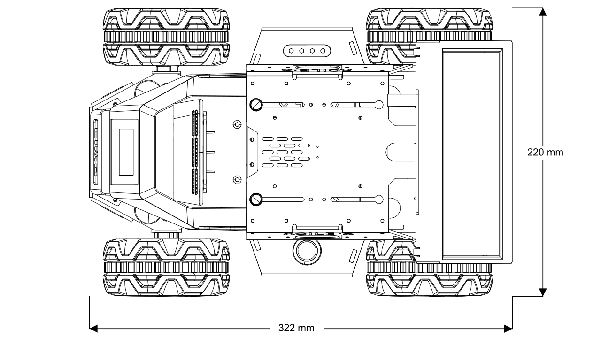

==============
Specifications
==============

Specifications Overview
=======================

.. list-table::
    :align: center

    * - Weight
      - 4.2kg
    * - Dimensions
      - 322x215x247mm
    * - Run Time
      - 40 minutes
    * - Standby Time
      - 2 hours
    * - Operating System
      - Ubuntu 18.04
    * - Climbable Slope
      - 25°
    * - Working Temperature Range
      - -10°C - 40°C
    * - Charging Interface
      - 5.5x2.1mm DC Barrel Jack
    * - CPU
      - ARM64 Quad Core 1.43GHz (Cortex-A57)
    * - GPU
      - 128core NVIDIA Maxwell™ @ 921MHz
    * - Battery
      - 12V Li-ion 5600mAh

Sensors & Onboard Devices
=========================

-   IMU MPU6050
-   EAI X2L LiDAR
-   ORBBEC DaBai Stereo Depth Camera
-   NVIDIA Jetson Nano 4G
-   iFLYTEK Voice Assistant
-   Dual Channel Speakers (2x2W)
-   USB Hub
-   Front Display
-   Rear Display

LIMO Component Overview
=======================

.. list-table::
    :widths: 70 30

    * - .. image:: _images/limo_front_right_labelled.png
            :align: center

      - 1.  Wi-Fi/Bluetooth Antennas
        2.  ORBBEC Dabai Stereo Depth Camera
        3.  Front Display
        4.  EAI X2L LiDAR
        5.  Hub Motor
        6.  RBG Status Indicator LEDs
        7.  Four-wheel Differential/Ackermann Steering Mode Switching Latches
        8.  Power Indicator
        9.  Left Speaker
        10. Left Seagull Door

    * - .. image:: _images/limo_rear_left_labelled.png
            :align: center

      - 11. Rear Touchscreen Display
        12. Batter Compartment Door
        13. Power Button
        14. Right Seagull Door
        15. Right Speaker

    * - .. image:: _images/limo_front_right_open_labelled.png
            :align: center

      - 16. USB Hub

    * - .. image:: _images/limo_rear_left_open_labelled.png
            :align: center

      - 17. Voice Module
        18. NVIDIA Jetson Nano (4G)
        19. Battery

Major Dimensions
================

.. image:: _images/limo_dimensions_side.png
    :align: center
    :width: 70%

