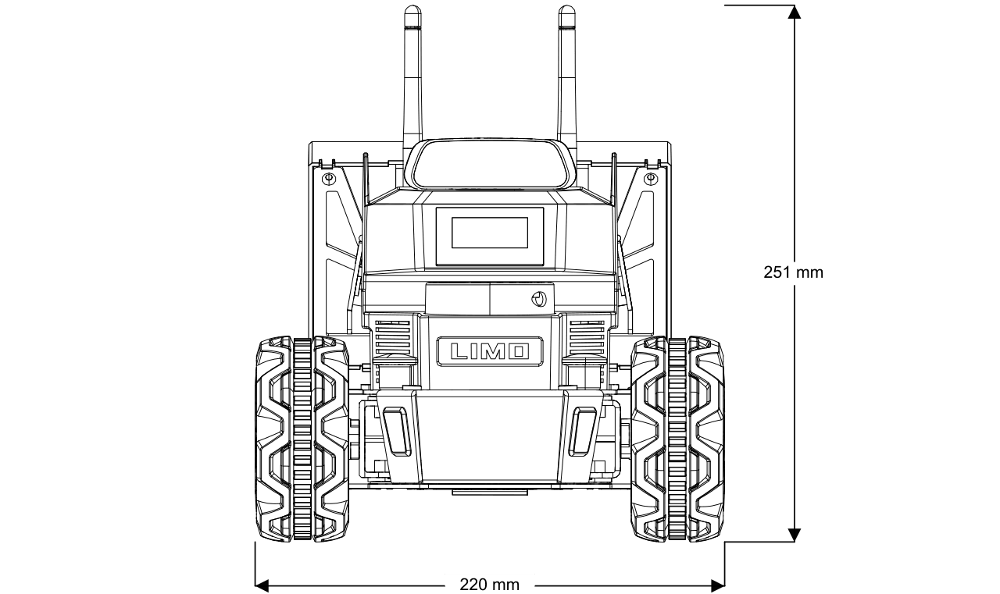
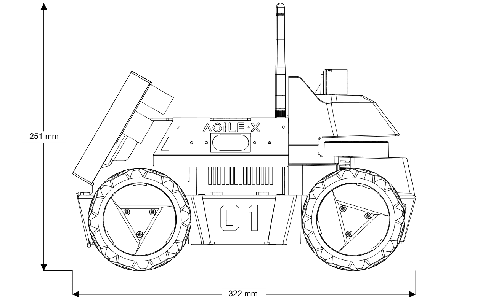
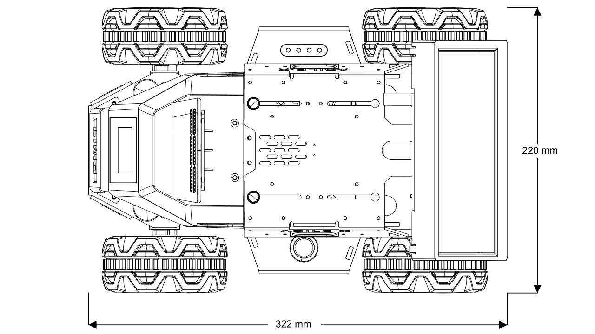

==============
Specifications
==============

LIMO Contents
=============

Your LIMO should come with the following:

*   1x LIMO Robot
*   1x Battery
*   1x Charger
*   4x Mecanum Wheels
*   2x Tracks
*   2x Wi-Fi/Bluetooth Antennas
*   1x Allen Wrench
*   3x M3x12mm Screws
*   20x M3x5mm Screws

Specifications Overview
=======================

.. list-table::
    :align: center

    * - Weight
      - 4.2kg
    * - Dimensions
      - 322x215x247mm
    * - Run Time
      - 40 minutes
    * - Standby Time
      - 2 hours
    * - Operating System
      - Ubuntu 18.04
    * - Climbable Slope
      - 25°
    * - Working Temperature Range
      - -10°C - 40°C
    * - Charging Interface
      - 5.5x2.1mm DC Barrel Jack
    * - CPU
      - ARM64 Quad Core 1.43GHz (Cortex-A57)
    * - GPU
      - 128core NVIDIA Maxwell™ @ 921MHz
    * - Battery
      - 12V Li-ion 5600mAh

Sensors & Onboard Devices
=========================

IMU MPU6050
-----------

.. _specifications-ydlidar-label:

EAI X2L LiDAR
-------------

The YDLIDAR X2L LiDAR is a 360 degree two-dimensional ranging product developed by Shenzhen EAI
Technology Co., Ltd. (EAI). This product is based on the principle of trigonometric ranging and is
equipped with related optical, electrical, and algorithm design to achieve high-frequency and
high-precision distance measurement. While measuring distance, the mechanical structure rotates 360
degrees and continuously obtains angle information, thereby achieving 360 degrees scanning distance
measurement, and output point cloud data of the scanning environment.

+--------------------+-------------+-------------+-------------+-------+--------------------------------------------------------------------------+
| **Items**          | Minimum     | Default     | Maximum     | Unit  | Remarks                                                                  |
+====================+=============+=============+=============+=======+==========================================================================+
| Ranging frequency  | /           | 3000        | /           | Hz    | 3000 ranging times per second                                            |
+--------------------+-------------+-------------+-------------+-------+--------------------------------------------------------------------------+
| Scanning frequency | 5           | 6           | 8           | Hz    | PWM signal needs to be connected, and the recommended frequency is 6Hz.  |
+--------------------+-------------+-------------+-------------+-------+--------------------------------------------------------------------------+
| Ranging range      | 0.12        | /           | 8           | m     | Indoor environment, and objects with 80% reflectivity                    |
+--------------------+-------------+-------------+-------------+-------+--------------------------------------------------------------------------+
| Scanning angle     | /           | 0-360       | /           | °     | /                                                                        |
+--------------------+-------------+-------------+-------------+-------+--------------------------------------------------------------------------+
| Absolute tolerance | /           | 2           | /           | cm    | When ranging ≤1m                                                         |
+--------------------+-------------+-------------+-------------+-------+--------------------------------------------------------------------------+
| Relative tolerance | /           | 3.5%        | /           | /     | When 1m < ranging ≤ 6m                                                   |
+--------------------+-------------+-------------+-------------+-------+--------------------------------------------------------------------------+
| Pitch angle        | 0.25        | 1           | 1.75        | °     | /                                                                        |
+--------------------+-------------+-------------+-------------+-------+--------------------------------------------------------------------------+
| Angle resolution   | 0.60 (5Hz)  | 0.72 (6Hz)  | 0.96 (8Hz)  | °     | Different scanning frequency                                             |
+--------------------+-------------+-------------+-------------+-------+--------------------------------------------------------------------------+

ORBBEC® DaBai Stereo Depth Camera
---------------------------------

+----------------------------------------------------------------------------------+--------------------------------------------------------------------------------------------------------------------------------------------------------------------------------+
| **Parameter name**                                                               | **Parameter index**                                                                                                                                                            |
+==================================================================================+================================================================================================================================================================================+
| The distance between the imaging centers of the left and right infrared cameras  | 40mm                                                                                                                                                                           |
+----------------------------------------------------------------------------------+--------------------------------------------------------------------------------------------------------------------------------------------------------------------------------+
| Depth distance                                                                   | 0.3-3m                                                                                                                                                                         |
+----------------------------------------------------------------------------------+--------------------------------------------------------------------------------------------------------------------------------------------------------------------------------+
| Power consumption                                                                | The average power consumption of the whole machine is <2W;The peak value at the moment the laser is turned on <5W (duration: 3ms);Typical standby power consumption is <0.7W.  |
+----------------------------------------------------------------------------------+--------------------------------------------------------------------------------------------------------------------------------------------------------------------------------+
| Depth map resolution                                                             | 640x400 @ 30FPS; 320x200 @ 30FPS                                                                                                                                               |
+----------------------------------------------------------------------------------+--------------------------------------------------------------------------------------------------------------------------------------------------------------------------------+
| Color map resolution                                                             | 1920x1080 @ 30FPS; 1280x720 @ 30FPS; 640x480 @ 30FPS                                                                                                                           |
+----------------------------------------------------------------------------------+--------------------------------------------------------------------------------------------------------------------------------------------------------------------------------+
| Accuracy                                                                         | 6mm @ 1m (81% FOV area participates in accuracy calculation*)                                                                                                                  |
+----------------------------------------------------------------------------------+--------------------------------------------------------------------------------------------------------------------------------------------------------------------------------+
| Depth FOV                                                                        | H 67.9° V 45.3°                                                                                                                                                                |
+----------------------------------------------------------------------------------+--------------------------------------------------------------------------------------------------------------------------------------------------------------------------------+
| Color FOV                                                                        | H 71° V43.7° @1920X1080                                                                                                                                                        |
+----------------------------------------------------------------------------------+--------------------------------------------------------------------------------------------------------------------------------------------------------------------------------+
| Delay                                                                            | 30-45ms                                                                                                                                                                        |
+----------------------------------------------------------------------------------+--------------------------------------------------------------------------------------------------------------------------------------------------------------------------------+
| Data transmission                                                                | USB2.0 or above                                                                                                                                                                |
+----------------------------------------------------------------------------------+--------------------------------------------------------------------------------------------------------------------------------------------------------------------------------+
| Supported operating system                                                       | Android / Linux / Windows7/10                                                                                                                                                  |
+----------------------------------------------------------------------------------+--------------------------------------------------------------------------------------------------------------------------------------------------------------------------------+
| Power supply mode                                                                | USB                                                                                                                                                                            |
+----------------------------------------------------------------------------------+--------------------------------------------------------------------------------------------------------------------------------------------------------------------------------+
| Operating temperature                                                            | 10°C ~ 40°C                                                                                                                                                                    |
+----------------------------------------------------------------------------------+--------------------------------------------------------------------------------------------------------------------------------------------------------------------------------+
| Applicable scene                                                                 | Indoor / outdoor (specifically subject to application scenes and related algorithm requirements)                                                                               |
+----------------------------------------------------------------------------------+--------------------------------------------------------------------------------------------------------------------------------------------------------------------------------+
| Dustproof and waterproof                                                         | Foundation dustproof                                                                                                                                                           |
+----------------------------------------------------------------------------------+--------------------------------------------------------------------------------------------------------------------------------------------------------------------------------+
| Safety                                                                           | Class 1 laser                                                                                                                                                                  |
+----------------------------------------------------------------------------------+--------------------------------------------------------------------------------------------------------------------------------------------------------------------------------+
| Dimensions (mm)                                                                  | Length 59.6 X width 17.4 X thickness 11.1mm                                                                                                                                    |
+----------------------------------------------------------------------------------+--------------------------------------------------------------------------------------------------------------------------------------------------------------------------------+

NVIDIA Jetson Nano 4G
---------------------

iFLYTEK Voice Assistant
-----------------------

Dual Channel Speakers (2x2W)
----------------------------

USB Hub
-------

Front Display
-------------

Rear Display
-------------

LIMO Component Overview
=======================

.. list-table::
    :widths: 70 30

    * - .. image:: _images/limo_front_right_labelled.png
            :align: center

      - 1.  Wi-Fi/Bluetooth Antennas
        2.  ORBBEC® Dabai Stereo Depth Camera
        3.  Front Display
        4.  EAI X2L LiDAR
        5.  Hub Motor
        6.  RBG Status Indicator LEDs
        7.  Four-wheel Differential/Ackermann Steering Mode Switching Latches
        8.  Power Indicator
        9.  Left Speaker
        10. Left Seagull Door

    * - .. image:: _images/limo_rear_left_labelled.png
            :align: center

      - 11. Rear Touchscreen Display
        12. Batter Compartment Door
        13. Power Button
        14. Right Seagull Door
        15. Right Speaker

    * - .. image:: _images/limo_front_right_open_labelled.png
            :align: center

      - 16. USB Hub

    * - .. image:: _images/limo_rear_left_open_labelled.png
            :align: center

      - 17. Voice Module
        18. NVIDIA Jetson Nano (4G)
        19. Battery

Major Dimensions
================

