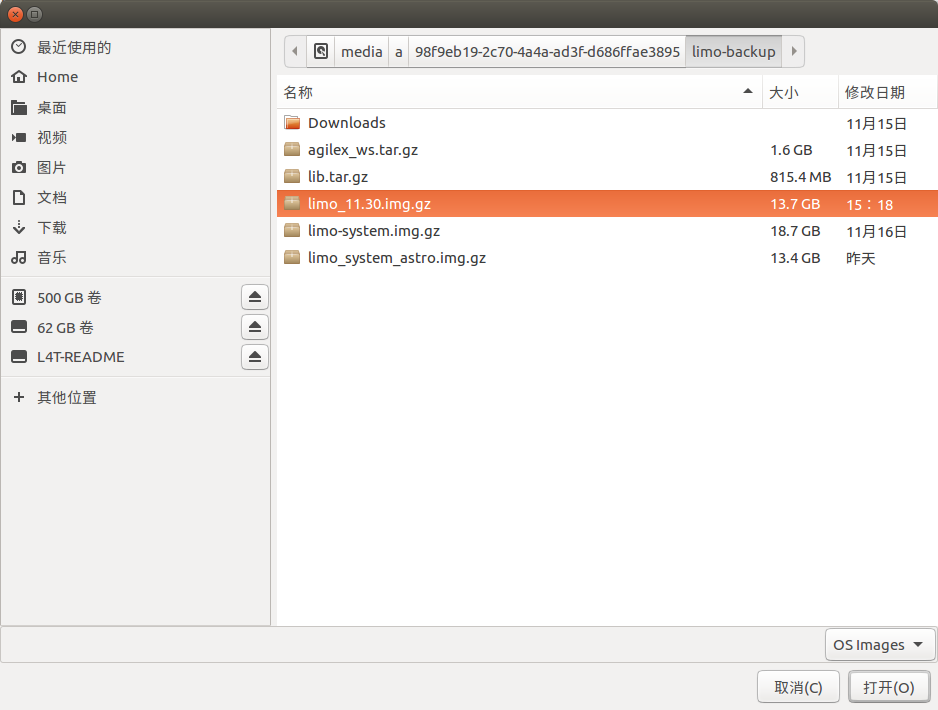
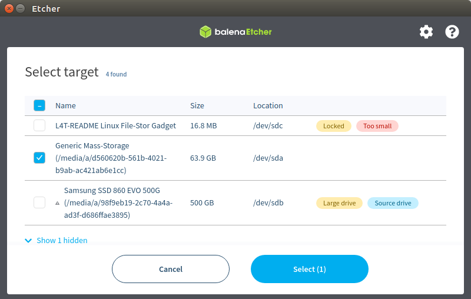
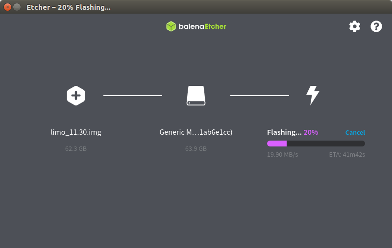

==================================
Flash the LIMO's Jetson Nano Image
==================================

1.  Download and install `balenaEtcher`_ on a PC according to its operating system and
    architecture.

.. _`balenaEtcher`: https://www.balena.io/etcher/

2.  Download the image provided by AgileX

    *   v1.2 - [`Google Drive`_]

.. _`Google Drive`: https://drive.google.com/file/d/16uIAMiD4ziUZyTxlAcFLeDGFdeaSvzlU/view?usp=sharing

3.  Open balenaEtcher and select the image to be burned.

.. image:: _images/balena_1.png
    :align: center

4.  Select the SD card that needs to be burned

5.  Click Flash to start burning

6.  The SD card can now be loaded back into the robot's Jetson Nano.
